# 🩺 Breast Cancer Diagnosis Using Machine Learning

> Machine learning-based breast cancer diagnosis using the **Breast Cancer Wisconsin dataset** — predicting whether a tumor is **benign or malignant** using deep learning and traditional ML techniques.

---

## 📘 Project Overview

Breast cancer is one of the most common cancers affecting women worldwide.  
This project builds a **neural network model** that classifies tumors as **benign (non-cancerous)** or **malignant (cancerous)** using features computed from a digitized image of a breast mass.

The model achieves **~98% accuracy**, demonstrating how machine learning can assist early diagnosis and clinical decision-making.

---

## 🧠 Model Architecture

```mermaid
flowchart LR
    A["📥 Data Collection"] --> B["🧹 Data Cleaning"]
    B --> C["⚙️ Feature Engineering"]
    C --> D["🧠 Model Training"]
    D --> E["📊 Model Evaluation"]
    E --> F["🚀 Deployment / Prediction"]
```

-----

## 🔍 Project Pipeline

```mermaid
flowchart TD
    A["📥 Dataset - Breast Cancer Wisconsin"] --> B["🧹 Data Preprocessing"]
    B --> C["📊 Train-Test Split"]
    C --> D["⚙️ Feature Scaling - StandardScaler"]
    D --> E["🧠 Model Building - Neural Network (Keras)"]
    E --> F["📈 Model Training"]
    F --> G["📊 Evaluation - Accuracy & Loss Curves"]
    G --> H["🎯 Predictions on Test Data"]
    H --> I["✅ Result - Benign or Malignant"]

    %% Node Colors
    style A fill:#FFB347,stroke:#333,stroke-width:2px,color:#000
    style B fill:#FFD700,stroke:#333,stroke-width:2px,color:#000
    style C fill:#FFA07A,stroke:#333,stroke-width:2px,color:#000
    style D fill:#87CEFA,stroke:#333,stroke-width:2px,color:#000
    style E fill:#9370DB,stroke:#333,stroke-width:2px,color:#fff
    style F fill:#40E0D0,stroke:#333,stroke-width:2px,color:#000
    style G fill:#FF69B4,stroke:#333,stroke-width:2px,color:#000
    style H fill:#98FB98,stroke:#333,stroke-width:2px,color:#000
    style I fill:#32CD32,stroke:#333,stroke-width:2px,color:#fff


```

----
⚙️ Tech Stack

| Category             | Tools / Libraries                |
| -------------------- | -------------------------------- |
| Programming Language | Python 3.x                       |
| Machine Learning     | TensorFlow / Keras, Scikit-learn |
| Data Processing      | Pandas, NumPy                    |
| Visualization        | Matplotlib, Seaborn              |
| Environment          | Jupyter Notebook / Google Colab  |

----

🧩 Model Performance
| Metric                  | Value               |
| ----------------------- | ------------------- |
| **Training Accuracy**   | ~99%                |
| **Validation Accuracy** | ~98%                |
| **Loss Function**       | Binary Crossentropy |
| **Optimizer**           | Adam                |

-----

🚀 Future Improvements

- Deploy as a Streamlit web app for interactive diagnosis
- Experiment with Deep Neural Networks (DNN) and CNNs
- Integrate with medical data APIs for real-world use

---
📜 License

This project is released under the MIT License — feel free to use and modify for research and learning purposes.
